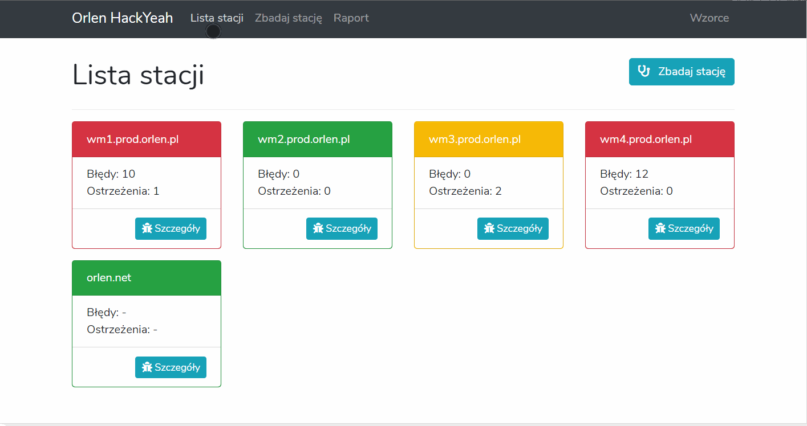

# HackYeah 2019 - IT Security Task by Orlen solution by "I do!" team

## Warning!
This solution was developed in 24 hours - it is not meant to be used in production enviroment. It lacks proper security, uses migrations dependent on source code and so on.

## Task
> The solution should generate a report concerning the level of cybersecurity based on the information provided, broken down by particular areas e.g. network area, workstation and server area, procedural area, automation application area. The solution should enable saving entered answers and saving reports along with the information about who and when entered the answer / generated the report.
>
>Assessing the level of cybersecurity should be based on a developed methodology, whose parameters should be configurable in the solution.

## Developed solution

We wanted to provide PKN Orlen with solution, which will be useful for their IT Operations Center by enabling administrators to do less manual chores and to have quick and powerfull view of data regarding their environment. The sollution does not affect OS on machine during check, only scrape required data and sends it back to the system for futher comparation with matched pattern.

Everything in this project was planed, coded and created (using some open-source frameworks) in 2 person team in 24 hours.

Main tools we used includes PowerShell Scripts, Laravel Framework and MySQL database.

Our tool is scallable, from 1 to thousands of workstations. We can easly add features to accomodate other options. The only one bottleneck are funcionalities of Windows Power Shell Tool and Windows Management Instrumentation Tool, both of which are used for taking information about workstations/servers.

## Contributors
Team members:
- Aleksander Jabłoński
- Lukas Kirylak